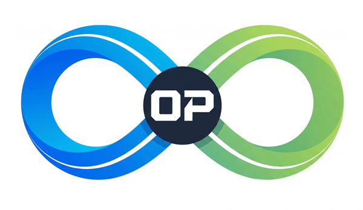

# Open Pace: A Federated Strava Alternative

A federated fitness tracking platform built on ActivityPub, using Quarkus and Vert.x. Share your runs, rides, and activities across the fediverse while maintaining ownership of your data.

## 🎯 The Vision



**Open Pace** is a federated alternative to Strava that:
- ✅ Lets you own your data (run your own instance or choose one you trust)
- ✅ Works with the fediverse (Mastodon users can follow your activities)
- ✅ Supports rich sports data (GPX, metrics, segments, leaderboards)
- ✅ Maintains privacy (you control who sees what)
- ✅ Enables data portability (export anytime, move instances)

## 🚀 Implementation Sprints

This project is structured as **10 implementation sprints** that build a complete federated ActivityPub application incrementally.

### Sprint 1: Basic ActivityPub Server
**Goal**: Get federation working end-to-end
- WebFinger for user discovery
- Actor profiles with ActivityPub endpoints
- Simple text posts
- Test by following from Mastodon

**Status**: 🚧 In Progress  
**Tag**: `v0.1.0-sprint1` (when released)

### Sprint 2: Custom Activity Types
**Goal**: Extend ActivityPub with sports-specific data
- Define Run/Walk/Ride/Swim object types
- Handle custom `Create` activities
- Store GPX data and metrics
- Render activities in your UI

**Status**: 📋 Planned  
**Tag**: `v0.2.0-sprint2` (when released)

### Sprint 3: Rich Data & Interop
**Goal**: Make it beautiful and interoperable
- Handle comments/likes from any ActivityPub server
- Full activity viewer for FediRun clients
- Attachments support (images, previews)
- Activity streams (your feed, following feed)

**Status**: 📋 Planned  
**Tag**: `v0.3.0-sprint3` (when released)

### Sprint 4: Sports-Specific Features
**Goal**: Strava-like competitive features
- Segment tracking (like Strava KOMs)
- Leaderboards across federated instances
- Clubs/groups (ActivityPub Groups)
- Challenges and goals

**Status**: 📋 Planned  
**Tag**: `v0.4.0-sprint4` (when released)

### Sprint 5: Privacy & Data
**Goal**: Production-ready privacy and data control
- Private activities (only to followers)
- Direct messages for training partners
- Export your data anytime (GPX, FIT files)
- Instance-level federation policies

**Status**: 📋 Planned  
**Tag**: `v0.5.0-sprint5` (when released)

### Sprint 6: Security Integration
**Goal**: Authentication and authorization
- User registration and login
- Password hashing (BCrypt)
- Secure C2S endpoints (only actor can post to their outbox)
- Verified field for future email verification
- Actor-User relationship

**Status**: 📋 Planned  
**Tag**: `v0.6.0-sprint6` (when released)  
**Strategy**: [Security Integration Guide](docs/SECURITY_INTEGRATION.md)

### Sprint 7: Mapping Integration
**Goal**: Geospatial data and map visualization
- GPX processing and track extraction
- PostGIS storage (LineString for tracks)
- Generate static map images with tracks overlaid on OpenStreetMap tiles
- Proper OSM attribution on all maps
- Display maps in ActivityPub activity attachments

**Status**: 📋 Planned  
**Tag**: `v0.7.0-sprint7` (when released)  
**Strategy**: [Mapping Integration Guide](docs/MAPPING_INTEGRATION.md)

### Sprint 8: Activity Analytics & Personal Records
**Goal**: Advanced analytics and personal record tracking
- Automatic personal record detection (fastest 5K, longest ride, etc.)
- Split analysis (per km/mile)
- Pace zones and heart rate zones
- Elevation profile visualization
- Comparative analysis (this run vs. average)
- Activity statistics dashboard

**Status**: 📋 Planned  
**Tag**: `v0.8.0-sprint8` (when released)

**Technical**:
- Time-series data analysis
- Efficient queries for PRs across all activities
- Chart generation (Recharts in React)
- Database indexes for performance queries

### Sprint 9: Social Interactions & Feed
**Goal**: Social features and activity feed
- Activity feed (timeline of followed users)
- Comments on activities (ActivityPub replies)
- Kudos/Likes (ActivityPub Like activities)
- Activity sharing to feed
- @mentions in comments
- Notifications for interactions

**Status**: 📋 Planned  
**Tag**: `v0.9.0-sprint9` (when released)

**Technical**:
- ActivityPub Create/Like/Announce activities
- Feed aggregation and ranking
- Real-time notifications (WebSocket or SSE)
- Efficient timeline queries

### Sprint 10: Gear & Equipment Tracking
**Goal**: Track equipment usage and maintenance
- Add bikes, shoes, other gear
- Track mileage/usage per gear
- Assign gear to activities (retroactively)
- Maintenance reminders
- Gear retirement tracking
- Default gear per activity type

**Status**: 📋 Planned  
**Tag**: `v1.0.0-sprint10` (when released)

**Technical**:
- Gear database schema
- Activity-gear relationship
- Aggregation queries for mileage
- Scheduled notifications for maintenance

## 🚀 Quick Start

### Prerequisites
- Java 21+ (LTS)
- Maven 3.8+
- Podman (for Quarkus Dev Services)
- Basic understanding of REST APIs

### Project Structure

This project uses a **single, evolving codebase** where each sprint builds incrementally on the previous one. Git tags provide access to the state of the codebase at each sprint completion.

**Repository Structure**:
- `src/main/java/org/openpace/` - Source code (packages added incrementally per sprint)
- `src/test/java/org/openpace/` - Tests
- `docs/` - Implementation guides and strategy documents
- `pom.xml` - Single Quarkus project configuration

**Accessing Previous Sprint States**:
```bash
# View Sprint 1 code
git checkout v0.1.0-sprint1

# View Sprint 2 code
git checkout v0.2.0-sprint2

# Return to latest development
git checkout develop
```

### Getting Started

1. **Clone and checkout the sprint you want to work with**:
   ```bash
   git clone <repository-url>
   cd open-pace
   
   # For Sprint 1
   git checkout v0.1.0-sprint1
   
   # Or work on latest development
   git checkout develop
   ```

2. **Start the application** (database starts automatically via Quarkus Dev Services):
   ```bash
   ./mvnw quarkus:dev
   ```
   
   Quarkus Dev Services will automatically:
   - Start a PostgreSQL container
   - Configure the database connection
   - Run Flyway migrations

3. **Implement or extend sprints**:
   - Follow the implementation guide in `docs/`
   - Build on existing codebase
   - Test with Mastodon

## 📖 Documentation

### Implementation Strategy
- **[Implementation Strategy](IMPLEMENTATION_STRATEGY.md)**: Overall approach, principles, structure, and workflow for implementation sprints
- **[Consistency Checklist](CONSISTENCY_CHECKLIST.md)**: Quality standards for each sprint

### Technology & Architecture
- **[Quarkus Tech Stack](docs/QUARKUS_TECH_STACK.md)**: ⚠️ **Technology choices, dependency philosophy, and why Quarkus** - **Read this before suggesting technology changes**

### Implementation Guides
- **[Database Design](docs/DATABASE_DESIGN.md)**: Schema design, indexing, and query patterns
- **[API Design](docs/API_DESIGN.md)**: ActivityPub vs Application endpoint organization, OpenAPI documentation
- **[Error Handling Strategy](docs/ERROR_HANDLING_STRATEGY.md)**: Validation and error response format
- **[Federation Delivery Strategy](docs/FEDERATION_DELIVERY_STRATEGY.md)**: Reliable activity delivery with retry and queue management
- **[Caching Strategy](docs/CACHING_STRATEGY.md)**: Multi-level caching (L1: memory, L2: Redis, L3: disk)
- **[Rate Limiting Strategy](docs/RATE_LIMITING_STRATEGY.md)**: Abuse prevention and resource protection
- **[Background Job Processing Strategy](docs/BACKGROUND_JOBS_STRATEGY.md)**: Asynchronous job processing with Redis queues
- **[HTTP Signatures Strategy](docs/HTTP_SIGNATURES_STRATEGY.md)**: S2S authentication for ActivityPub federation
- **[Architectural Gaps](docs/ARCHITECTURAL_GAPS.md)**: Analysis of missing architectural elements

### ActivityPub & Features
- **[ActivityPub C2S Pattern](docs/ACTIVITYPUB_C2S_PATTERN.md)**: Correct client-to-server implementation
- **[Mapping Integration](docs/MAPPING_INTEGRATION.md)**: OpenStreetMap and geospatial data strategy
- **[Security Integration](docs/SECURITY_INTEGRATION.md)**: Authentication and authorization strategy

### Implementation Guides
- **[Sprint 1 Implementation](docs/sprint-1-basic-activitypub.md)**: Start here!

### Planning & Backlog
- **[Product Backlog](docs/BACKLOG.md)**: Feature ideas, future sprints, and roadmap

## 🏗️ Architecture

### Tech Stack
- **Quarkus**: Java framework optimized for cloud-native
- **Vert.x**: Async, non-blocking processing (perfect for GPX processing, map generation)
- **PostgreSQL**: Data storage
- **ActivityPub**: W3C standard for federated social networking

See **[Quarkus Tech Stack](docs/QUARKUS_TECH_STACK.md)** for detailed versions and technology choices.

### Why Vert.x?
- **Async GPX processing**: Parse large files without blocking
- **Map tile generation**: Generate images efficiently
- **Efficient federation**: Deliver activities to many followers
- **WebSocket support**: Live activity tracking
- **Non-blocking I/O**: Handle webhook-style inbox POSTs

## 🧪 Testing

Each tutorial part includes:
- Unit tests for business logic
- Integration tests for ActivityPub endpoints
- Manual test scripts (curl commands)
- Mastodon compatibility testing

Run tests:
```bash
./mvnw test
```

## 🤝 Contributing

We welcome contributions! Please read our [Contributing Guide](CONTRIBUTING.md) for details on:

- How to contribute (including AI-assisted contributions)
- Code standards and review process
- Git workflow and branch naming
- What to contribute and priorities

**Quick start**: Fork the repo, create a feature branch from `develop`, make your changes, and submit a Pull Request.

## 📄 License

[Add your license here]

## 🔗 Resources

- [ActivityPub Specification](https://www.w3.org/TR/activitypub/)
- [JSON-LD Context](https://www.w3.org/ns/activitystreams)
- [Quarkus Documentation](https://quarkus.io/)
- [Vert.x Documentation](https://vertx.io/)

## 💡 The Core Concept

When you post a run on Open Pace:

1. **Your server** creates an ActivityPub `Create` activity
2. **The activity** is sent to all your followers' inboxes
3. **Mastodon users** see: "Alice ran 5km in 25:30" (rendered as a post)
4. **FediRun users** see the full activity with map, splits, heart rate
5. **Anyone** can like or comment from their ActivityPub server

This is the power of federation: **interoperability without centralization**.
